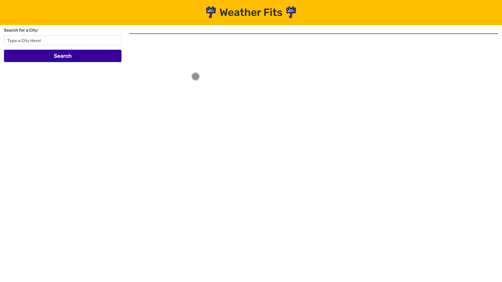

# Weather_Fit &#9748;

## Technology Used 🖥️

| Technology Used         | Resource URL           | 
| ------------- |:-------------:| 
| JavaScript | [https://developer.mozilla.org/en-US/docs/Web/JavaScript](https://developer.mozilla.org/en-US/docs/Web/JavaScript)     |  
| jQuery | [https://jquery.com/](https://jquery.com/)     |    
| OpenWeather API | [https://openweathermap.org/api](https://openweathermap.org/api)     |    
| Day.js | [https://day.js.org/en/](https://day.js.org/en/)     |    
| Bootstrap | [https://getbootstrap.com/](https://getbootstrap.com/)     |    
| Google Fonts | [https://fonts.google.com/](https://fonts.google.com/)     |    
| Font Awesome | [https://fontawesome.com/](https://fontawesome.com/)     |    
| HTML    | [https://developer.mozilla.org/en-US/docs/Web/HTML](https://developer.mozilla.org/en-US/docs/Web/HTML) | 
| CSS     | [https://developer.mozilla.org/en-US/docs/Web/CSS](https://developer.mozilla.org/en-US/docs/Web/CSS)      |   
| Git | [https://git-scm.com/](https://git-scm.com/)     |    

--------

## Description 📝

Something that everyone encounters in their day-to-day is choosing what to wear. Sometimes it's as simple as throwing on your favorite hoodie and any decently clean pants and going about with your day. Other times, it's important to dress up a bit more. 

That's why I wanted to build this weather app. Because I live in Seattle, choosing the right clothes that feel good, makes me look good, and won't get ruined in the myriad of weather conditions we have up here is important. 



Through this weather dashboard, it quickly lets me look up my city to see the current weather information along with the five day forecast! With the power of the OpenWeather API, the app displays the most accurate weather information possible.

----------

## Table of Contents 📋

* [Learning Points](#learning-points-✍️)
* [API Call Example](#api-call-example-📞)
* [Usage](#usage-📥)
* [Author Info](#author-info-👺)
* [License](#license-🚩)

------------

## Learning Points ✍️

One very important lesson learned during the creation of this app was the overall importance of using APIs as a way to enhance the user experience. 

As a developer, using APIs and third party libraries can be a lifesaver while creating an app. It would be incredibly arduous to parse through weather information as a general search query in Google and display that information the user. But thanks to the OpenWeather API, querying for the correct information and styling it by myself gives me more control in the user experience.

-------------

## API Call Example 📞

Below is an example of an API call I used in this app to get data for the current weather information for the users' queried city.

``` JavaScript
    fetch('https://api.openweathermap.org/data/2.5/weather?lat='+data.lat+'&lon='+data.lon+'&appid=4b8fc9e50a57f1de38a6a899538e2356&units=imperial')
    .then(function (r){
        if(r.ok){
            return r.json();
        }
    })
```

--------------

## Usage 📥

To use the app, simply go to [https://daevidvo.github.io/Weather_Fit/](https://daevidvo.github.io/Weather_Fit/) OR download/clone the repo on to your local computer and open index.html! 🥳🥳🥳

-----------

## Author Info 👺

### **David Vo**

* [Github](github.com/daevidvo)
* [LinkedIn](linkedin.com/in/daevidvo)
* [Instagram](instagram.com/daevidvo)

---------------

## License 🚩

MIT License

Copyright (c) 2023 daevidvo

Permission is hereby granted, free of charge, to any person obtaining a copy
of this software and associated documentation files (the "Software"), to deal
in the Software without restriction, including without limitation the rights
to use, copy, modify, merge, publish, distribute, sublicense, and/or sell
copies of the Software, and to permit persons to whom the Software is
furnished to do so, subject to the following conditions:

The above copyright notice and this permission notice shall be included in all
copies or substantial portions of the Software.

THE SOFTWARE IS PROVIDED "AS IS", WITHOUT WARRANTY OF ANY KIND, EXPRESS OR
IMPLIED, INCLUDING BUT NOT LIMITED TO THE WARRANTIES OF MERCHANTABILITY,
FITNESS FOR A PARTICULAR PURPOSE AND NONINFRINGEMENT. IN NO EVENT SHALL THE
AUTHORS OR COPYRIGHT HOLDERS BE LIABLE FOR ANY CLAIM, DAMAGES OR OTHER
LIABILITY, WHETHER IN AN ACTION OF CONTRACT, TORT OR OTHERWISE, ARISING FROM,
OUT OF OR IN CONNECTION WITH THE SOFTWARE OR THE USE OR OTHER DEALINGS IN THE
SOFTWARE.

-----------------------